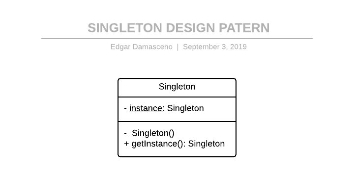

### Creational Design Pattern
# Singleton Design Pattern
Singleton design pattern is used when you want to have only one instance of a given class. It is a creational design pattern wherein we deal with the creation of objects.

# Implementation One
### UML DIAGRAM


### CODE WITH COMMENTS
`/implentation_one/src/main/java/Singleton.java`

```java
class Singleton {

    /*
     * This variable will be used to hold reference of Singleton class.
     */
    private static Singleton instance = null;

    /*
	 * As private constructor is used so can not create object of this class
	 * directly. Except by using static method of same class.
	 */
	private Singleton() {
    
    }

    /*
	 * This method will be used to get instance of Singleton class. 
     * Creating an instance of the Singleton class if it does not exist,
     * and returning it, or simply returning if the instance already exists.
	 */
	static Singleton getInstance() {
		if (instance == null) {
			instance = new Singleton();
		} 
		return instance;
	}

}
```

### CODE TEST WITH COMMENTS
`/implentation_one/src/test/java/SingletonTest.java`

```java
import org.junit.Test;
import org.junit.Before;
import static org.junit.Assert.*;

public class SingletonTest {
    /*
     * Variables that will store instances of the Singleton class.   
     */
    private Singleton instanceOne;
    private Singleton instanceTwo;

    /*
     * Method performed before the test that initializes the
     * above variables (instanceOne and instanceTwo).   
     */
    @Before
    public void initialize() {
        this.instanceOne = Singleton.getInstance();
        this.instanceTwo = Singleton.getInstance();
    }

    /*
     * Test that verifies that both variables point to the same instance
     * of the singleton class.
     */
    @Test
    public void testAreTheyTheSameInstance() {
        assertSame(instanceOne, instanceTwo);
    }

}
```

### EXECUTING
To run the test go to the `./implentation_one` directory and run the command

```
./gradlew test
```

or

```
gradle test
```

if you have installed and configured gradle in your environment.